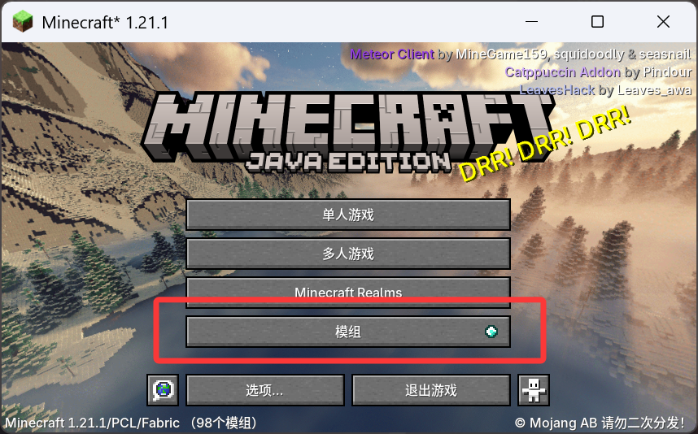
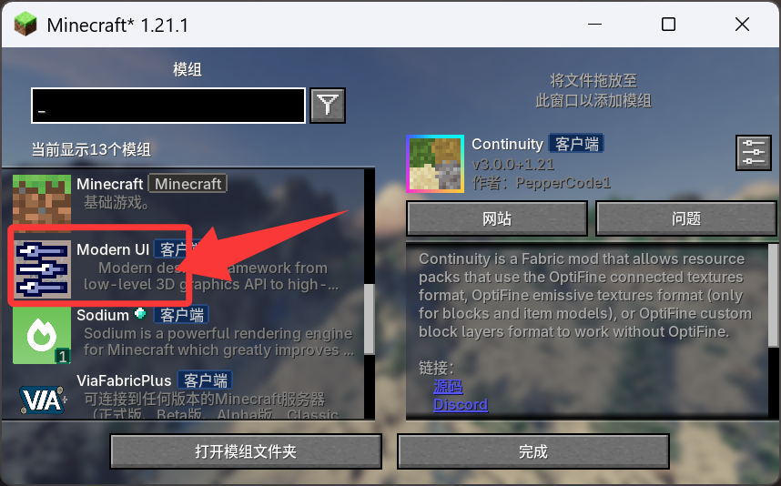
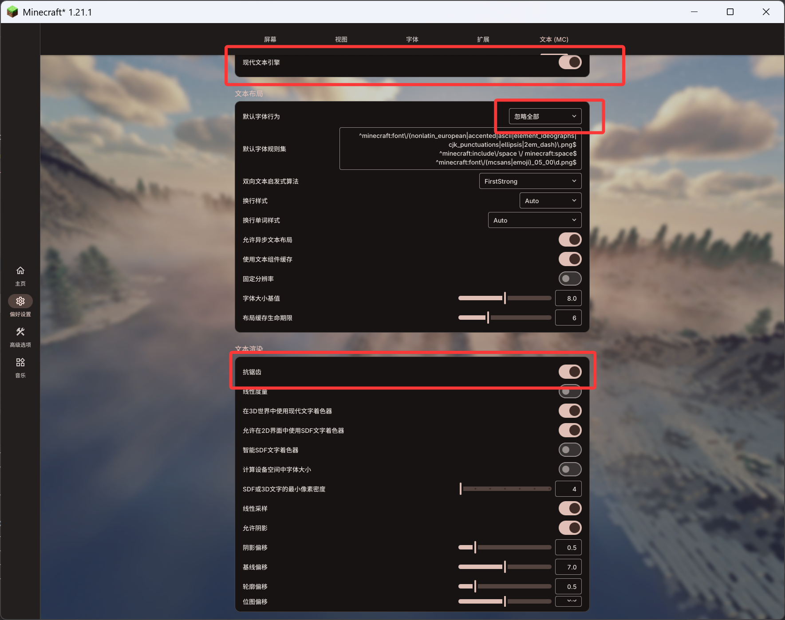
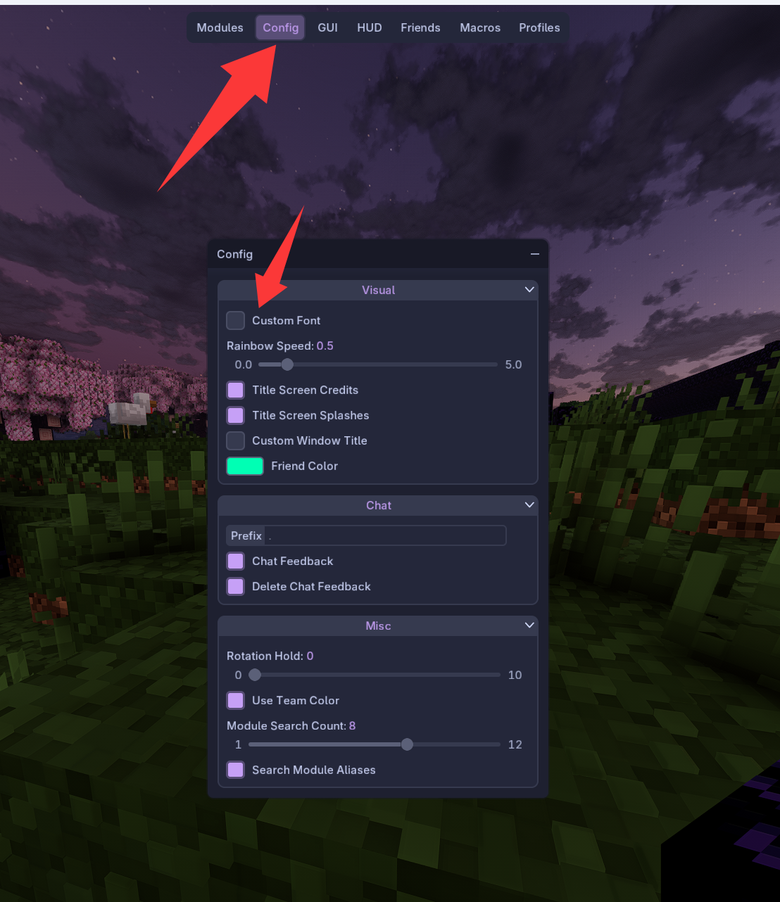
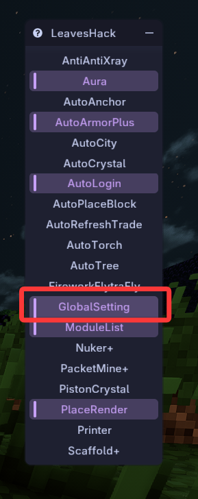
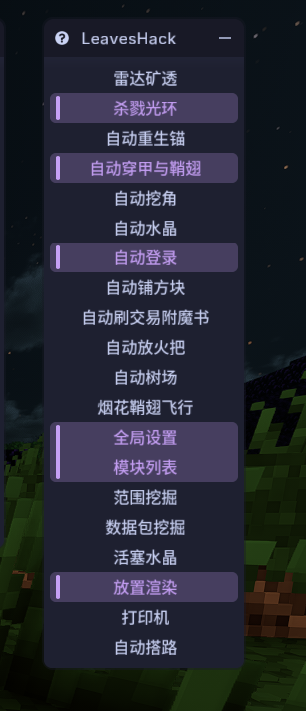

# LeavesHack-Addon汉化教程
## 下载模组
**现代化UI**(修复Meteor不正常渲染中文的Bug)
**模组菜单**(现代化UI有Bug打不开他的菜单，所以要借助这个模组来打开)  
## 打开现代化UI修改配置
  
找到现代化UI，打开他

照着这样调，打开现代文本引擎，将字体行为改为忽略全部，打开抗锯齿(不然字体会很糊)

## 修改Meteor配置
关闭Meteor的默认自定义字体行为(我加了美化包看起来和正常Meteor的UI有点不同但是布局是一样的)

## 打开LeavesHack的汉化
右键GlobalSetting(全局设置)功能，打开Chinese即可

汉化后效果：
