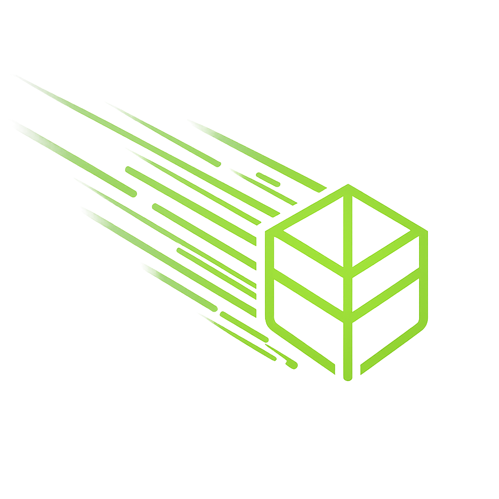

  
  <h1>LeavesHack-Addon for Meteor Client</h1>

    
    
    
    

Meteor客户端插件，适配Grim反作弊，优化无政府服务器游玩体验

  <a href="https://github.com/MrBZBZ/LeavesHack/releases" class="btn-primary">立即下载</a>
  <a href="/doc1/" class="btn-secondary">查看安装教程</a>

